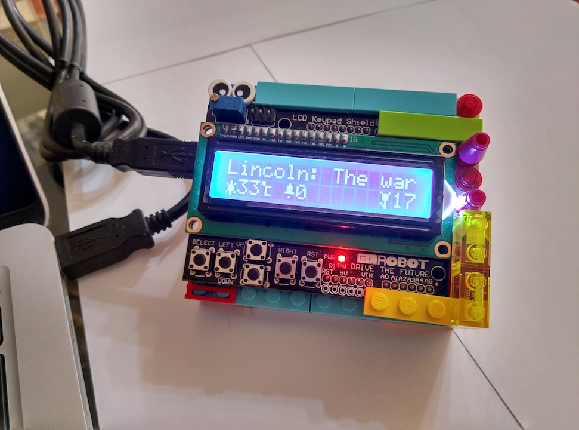

# Butlerino
> Butler + Arduino !

<!-- [![NPM Version][npm-image]][npm-url]
[![Build Status][travis-image]][travis-url]
[![Downloads Stats][npm-downloads]][npm-url] -->




## Installation

You need to install the required libraries: requests, newspaper, schedule

## Usage example

* Use platform.io to upload code to Arduino. You can use Arduino IDE too.
```sh
python3 butler.py
```
## Functions
* Weather
* emails (todo)
* Git commits in the last day/week
* News from any online newspaper
* Tweets from the desired account (todo)

## Development setup

You need to install the required libraries: requests, newspaper, schedule

## Credits
* [Glyphduino](http://rastating.github.io/Glyphduino/)
* [ArduinoJson](https://github.com/bblanchon/ArduinoJson)

## Contributing

1. Fork it!
2. Create your feature branch: `git checkout -b my-new-feature`
3. Commit your changes: `git commit -am 'Add some feature'`
4. Push to the branch: `git push origin my-new-feature`
5. Submit a pull request :D

## Release History

* 0.1.0
    * The first proper release
* 0.0.1
    * Work in progress

## Meta

Jeferson Arboleda – me@jarboleda.me - https://www.jarboleda.me

Distributed under the MIT license. See ``LICENSE`` for more information.

[https://gitlab.com/jag7](https://gitlab.com/jag7)

[npm-image]: https://img.shields.io/npm/v/datadog-metrics.svg?style=flat-square
[npm-url]: https://npmjs.org/package/datadog-metrics
[npm-downloads]: https://img.shields.io/npm/dm/datadog-metrics.svg?style=flat-square
[travis-image]: https://img.shields.io/travis/dbader/node-datadog-metrics/master.svg?style=flat-square
[travis-url]: https://travis-ci.org/dbader/node-datadog-metrics
